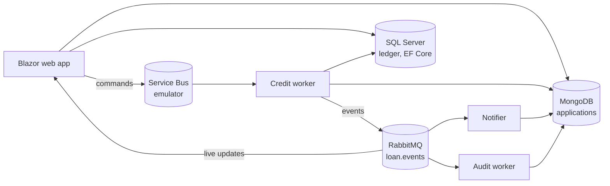

# LoanFlow

A small loan-application pipeline, built to learn **Blazor**, **dependency injection**,
**Azure Service Bus**, **RabbitMQ** and **Entity Framework Core**, with **MongoDB** for the
application workflow and **SQL Server** for the loans that get paid out.

An applicant submits a loan application in Blazor. A worker scores it against a (fake,
deliberately flaky) credit bureau and approves, rejects or sends it to manual review.
Events fan out to a notifier, an audit log and back to the browser as live updates.
Approved offers expire unless accepted; an accepted offer becomes a loan with a repayment
schedule in SQL Server.



**Why two brokers?** A real system would usually pick one. Here each does what it's best at:
Service Bus carries *commands* (sessions for per-application ordering, duplicate detection,
scheduled messages, dead-lettering built in); RabbitMQ carries *events* (flexible fan-out with
exchanges and routing keys). Knowing when you'd choose which is a good interview answer.

**Why two databases?** The same idea. An application is one document with its history embedded,
read and written whole: a natural fit for MongoDB. A loan that has been paid out is ledger data:
fixed columns, money that must add up, and a loan, its schedule and the event announcing it
written in one transaction. That's what a relational database and EF Core are good at.

## What's in the box

| Path | What it is |
|---|---|
| `src/LoanFlow.Core` | Domain model (applications, loans and schedules), message contracts, interfaces. No infrastructure dependencies. |
| `src/LoanFlow.Infrastructure` | MongoDB, Service Bus, RabbitMQ and EF Core implementations, health checks, and `DependencyInjection.cs`, where every lifetime decision is made and explained. |
| `src/LoanFlow.Web` | Blazor Web App (Interactive Server render mode available per page). |
| `src/LoanFlow.Worker` | Worker Service that processes commands and applies EF Core migrations in Development. |
| `tests/LoanFlow.Tests` | xUnit tests. |
| `docker-compose.yml` | RabbitMQ, the Service Bus emulator, and SQL Server (shared by the emulator and the ledger). |
| `servicebus/Config.json` | The emulator's queues, with sessions, duplicate detection and retry limits. |
| `scripts/add-migration.sh` | Adds an EF Core migration for the ledger. |
| `.config/dotnet-tools.json` | Pins the `dotnet-ef` tool version, so no global install is needed. |

Working now: the solution structure, DI wiring, options validation, health checks and a
`/status` page that shows whether MongoDB, Service Bus, RabbitMQ and SQL Server are reachable.
Everything you're here to learn is left for you, marked `TODO(step N)`:

```bash
git grep -n "TODO(step 1)"
```

## Prerequisites

- .NET 10 SDK
- Docker Desktop (WSL 2 backend on Windows)
- MongoDB running on `localhost:27017`

## Step 0: get it running

```bash
cp .env.example .env         # PowerShell: Copy-Item .env.example .env
```

Edit `.env`: read the two license links, set `ACCEPT_EULA=Y`, and set a strong
`MSSQL_SA_PASSWORD` (8+ characters, three of upper/lower/digit/symbol, no `;` or `"`).

The ledger connection string contains that password, so it goes in
[user secrets](https://learn.microsoft.com/aspnet/core/security/app-secrets) (stored in your
user profile, outside the repository) instead of `appsettings.json`. Web and Worker share a
user-secrets id, so one command configures both:

```bash
dotnet user-secrets set "ConnectionStrings:ledger" "Server=localhost,14330;Database=LoanFlowLedger;User Id=sa;Password=YOUR_MSSQL_SA_PASSWORD;TrustServerCertificate=True;Connect Timeout=5" --project src/LoanFlow.Web
```

(`TrustServerCertificate=True` accepts the container's self-signed certificate. Fine locally,
never in production.)

```bash
docker compose up -d
docker compose ps            # rabbitmq, servicebus-emulator and mssql should be running
dotnet build
dotnet test
dotnet run --project src/LoanFlow.Web --launch-profile https
```

Open <https://localhost:7133/status>. MongoDB, Service Bus and RabbitMQ should be green.
SQL Server should be yellow ("no migrations yet") until step 4; red means it can't connect.
The emulator waits for SQL Server before it starts, so give it 20–30 seconds after
`docker compose up` before worrying about a red Service Bus row. If the browser complains
about the certificate, run `dotnet dev-certs https --trust` once.

In a second terminal:

```bash
dotnet run --project src/LoanFlow.Worker
```

It should log that there are no EF Core migrations yet, and that `ApplicationProcessor` and
`OutboxRelay` are stubs.

Handy URLs:

- RabbitMQ management UI: <http://localhost:15672> (guest / guest)
- Service Bus emulator health: <http://localhost:5300/health>
- Plain-text app health: <https://localhost:7133/health>
- SQL Server: `localhost,14330`, user `sa`, for SSMS, Azure Data Studio or Rider

## Dependency injection: where the decisions are

All shared registrations are in `src/LoanFlow.Infrastructure/DependencyInjection.cs`, called
from both `Program.cs` files, so Web and Worker get identical wiring.

| Service | Lifetime | Why |
|---|---|---|
| `IMongoClient`, `IMongoDatabase` | Singleton | Thread-safe; the client owns the connection pool. |
| `ServiceBusClient` | Singleton | Owns the AMQP connection. The emulator allows 10 concurrent connections by default, so a client per request fails fast. |
| `RabbitMqConnection` | Singleton | One connection per app, opened lazily because RabbitMQ.Client 7 only connects asynchronously. |
| `IDbContextFactory<LedgerDbContext>` | Singleton | What Blazor components use: a short-lived context per operation. |
| `LedgerDbContext` | Scoped | What the Worker uses, one per message. Never in Blazor Server, where scoped means "as long as the browser tab is open". |
| `ILoanApplicationRepository` | Scoped | One per request, per Blazor circuit, or per message in the Worker. |
| `ICreditBureau`, `ICommandSender`, `IEventPublisher` | Singleton | Stateless or thread-safe. |
| `TimeProvider` | Singleton | Instead of `DateTime.UtcNow`, so tests can control time. |
| Options classes | Validated on start | A typo in config stops the app at startup with a clear message, not on the first message. |

Two things to try on purpose:

1. Inject `ILoanApplicationRepository` straight into `ApplicationProcessor`'s constructor and
   run the Worker. In Development the host refuses to start: *Cannot consume scoped service
   ... from singleton*. That's the captive-dependency check. Undo it.
2. Set `CreditPolicy:ManualReviewBelowScore` below `RejectBelowScore` in the Worker's
   appsettings. The app won't start, and the error says why.

## Build plan

One branch and pull request per step keeps each change reviewable.

### Step 1: Blazor + MongoDB + DI (no messaging yet)

- [ ] Implement `MongoLoanApplicationRepository`. `TryTransitionAsync` is the important one:
      a single `UpdateOneAsync` whose filter includes the expected status.
- [ ] `/apply`: an `EditForm` with DataAnnotations validation that saves the application.
- [ ] `/applications`: a list, plus a details page at `/applications/{id}`.
- [ ] A temporary Approve button on the details page that calls `TryTransitionAsync` directly.

**Done when** you can submit and view applications, and clicking Approve in two tabs on the same
application succeeds in one and reports "already decided" in the other.

### Step 2: Azure Service Bus

- [ ] `ServiceBusCommandSender`. After saving, `/apply` sends `ProcessApplication`
      (session id = application id, message id = a `SubmissionId` generated when the form renders).
- [ ] `ApplicationProcessor` becomes a `ServiceBusSessionProcessor`. Complete on success, abandon on
      `CreditBureauUnavailableException` (retried until `MaxDeliveryCount`, then dead-lettered),
      dead-letter anything else straight away.
- [ ] Decision rules using `CreditPolicyOptions`. A reasonable set:
  - payment remarks, or amount over `MaxAmount`: reject
  - score below `RejectBelowScore`: reject
  - (existing debt payments + new monthly payment) / monthly income above `MaxDebtToIncomeRatio`: reject
  - score below `ManualReviewBelowScore`: manual review
  - otherwise approve. `Annuity.MonthlyPayment` in Core gives you the new monthly payment.
- [ ] On approval, schedule `ExpireOffer` at now + `OfferLifetime` and store the sequence number
      on the offer. `AcceptOffer` cancels it. Add a processor for the `offer-expiry` queue.
- [ ] An ops page that peeks the dead-letter queue (`SubQueue.DeadLetter`) and resubmits messages.

**Done when** a double-clicked Submit creates one application; with `FakeCreditBureau:FailureRate`
at 0.9 you can watch messages retry and end up in the dead-letter queue; and an unaccepted offer
expires after `OfferLifetime`.

Accept and expiry race each other on purpose (different queues). The conditional update in
`TryTransitionAsync` settles it: whichever arrives second finds the status already changed.

### Step 3: RabbitMQ

- [ ] `RabbitMqEventPublisher`. The worker publishes `ApplicationDecided`, `OfferExpired` and so on.
- [ ] A notifier consumer that writes fake emails to an `inbox` collection (plus an Inbox page),
      and an audit consumer that appends every event to an `audit` collection.
- [ ] Live updates: a singleton hub in the web app that components subscribe to, fed by a hosted
      service consuming an exclusive, auto-delete queue bound to `#`.
- [ ] Manual acks, prefetch (`BasicQosAsync`), and a dead-letter exchange for poison messages.
- [ ] Idempotent consumers. RabbitMQ delivers at least once, so the same event can arrive twice.

**Done when** two tabs on the same application both update live when the worker decides, and
events published while the notifier was stopped are delivered when it starts again.

### Step 4: EF Core and SQL Server (the ledger)

An accepted offer becomes a loan. `Loan.Open` already builds the repayment schedule (and has
tests); your job is everything EF Core.

- [ ] Finish the mapping in `Ledger/Configuration` before creating any migration: decimal
      precision, a unique index on `ApplicationId`, `RowVersion` as a concurrency token, the status
      as a string, and an index for the outbox relay.
- [ ] First migration: `./scripts/add-migration.sh InitialLedger`, and read the generated `Up()`.
      Start the Worker; it applies the migration and `/status` turns green.
- [ ] Handle `AcceptOffer`: move the application to `OfferAccepted` in MongoDB, then add
      `Loan.Open(...)` and `OutboxMessage.For(RoutingKeys.LoanOpened, ...)` to the context and call
      `SaveChangesAsync` once, so both rows commit in one transaction.
- [ ] `OutboxRelay`: publish pending outbox rows to RabbitMQ and mark them processed.
- [ ] `/loans` and `/loans/{id}` using `IDbContextFactory`, with a Mark paid button per installment.
- [ ] Change the model after the first migration (add a column, say) and add a second migration.

**Done when** accepting an offer produces a loan with its installments in SQL Server and a
`loan.opened` event in RabbitMQ; with RabbitMQ stopped, accepting an offer still saves the loan
and the event goes out once RabbitMQ is back; and paying the same installment from two tabs
fails in the second with a concurrency error.

### Step 5: Tests and observability

- [ ] Unit tests for the decision rules and for offer expiry with `FakeTimeProvider`
      (`Microsoft.Extensions.TimeProvider.Testing`).
- [ ] A test that fails when the EF model changed without a migration
      (`db.Database.HasPendingModelChanges()`).
- [ ] Integration tests with Testcontainers (it has MongoDB, RabbitMQ, SQL Server and Service Bus modules).
- [ ] Structured logging with the application id in a log scope.
- [ ] OpenTelemetry, and the Aspire dashboard to follow one application across every hop.

### Step 6 (optional): real Azure

- [ ] Create a Standard namespace (sessions and duplicate detection need Standard) with the same
      queues, and switch the connection string. Same code, different broker.
- [ ] Replace the connection string with managed identity / `DefaultAzureCredential`, the one thing
      the emulator can't do. Delete the namespace when you're done.
- [ ] Point the ledger at Azure SQL Database. Add `EnableRetryOnFailure()` to `UseSqlServer` for
      transient cloud errors, and read what it means for explicit transactions.

## Troubleshooting

| Symptom | Likely cause |
|---|---|
| `mssql` exits right away | `ACCEPT_EULA` isn't `Y`, or the password is too weak. `docker compose logs mssql` |
| Service Bus red on `/status` | Emulator still starting (wait ~30 s), or it failed: `docker compose logs servicebus-emulator` |
| SQL Server red on `/status` | Container not running, or the password in user secrets differs from `.env`. `dotnet user-secrets list --project src/LoanFlow.Web` shows what's set. |
| App won't start: "Set ConnectionStrings:ledger" | The user-secrets step in step 0 hasn't been done. |
| "port 5672 is already allocated" | Something else uses 5672, often a locally installed RabbitMQ service. Stop it; this setup runs RabbitMQ in Docker on 5673. |
| MongoDB red | The MongoDB service isn't running, or it isn't on 27017. |
| Messages gone after restarting the emulator | Expected: the emulator doesn't persist messages or entities across restarts. Max time-to-live is also 1 hour. |
| Ledger data gone | `docker compose down` removes the SQL Server container. Use `stop`/`start` to keep it; the Worker recreates the schema either way. |
| Worker fails: "model ... has pending changes" | You changed the EF model without a migration. Add one with `scripts/add-migration.sh`. |
| "A second operation was started on this context instance" | A `DbContext` used by two operations at once, typically a scoped one in Blazor. Use `IDbContextFactory`. |
| `$'\r': command not found` from the script | Windows line endings. `.gitattributes` keeps `*.sh` as LF; re-checkout, or run `dos2unix`. |
| `@onclick` does nothing | The page has no `@rendermode`, so it's static server-rendered. Add `@rendermode InteractiveServer`. |
| Tutorial code has `CreateModel()` | That's RabbitMQ.Client 6. Version 7 is async-only: `CreateChannelAsync`, `IChannel`. |
| Guid serialization error from MongoDB | Driver 3.x needs a Guid representation. `MongoConventions.Register()` sets it; make sure it runs. |

## Getting feedback

Push the repository to GitHub (public doubles as a portfolio piece) and work in one branch
per step. `.github/workflows/ci.yml` builds and runs the tests on every push and pull request,
so each PR shows a pass/fail result. For a review, name the repository (`owner/repo`) and the
branch or pull request in a Claude conversation.
